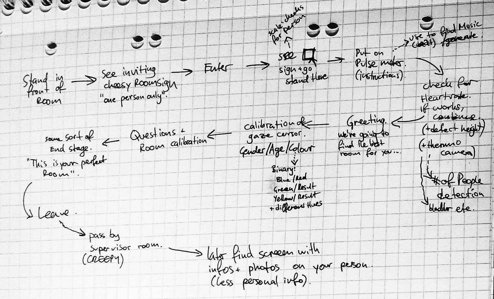

# Room Of Requirements

This repository contains code/assets needed to run an art-instalation that is part of the Data Driven Narratives seminar at HfG.

This artwork wants to explore the astetics of personalization in a very personal setting: your own perfect room.

At the same time we want to explore the slip-side to this: Mining personal data and building user profiles, which is usually hidden from the users of personalized systems.

## User interaction

Below is a sketch for a possible user interaction with the room.

